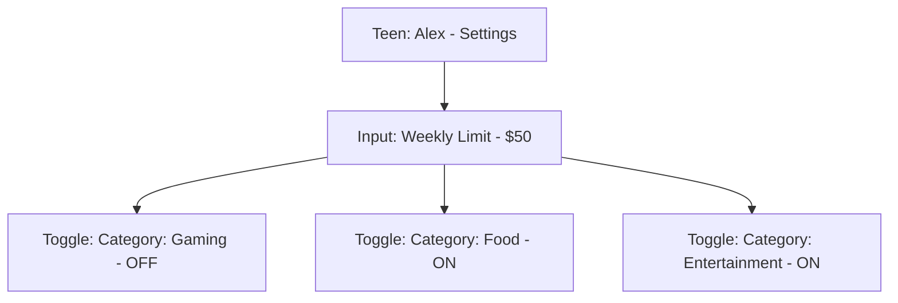

# mystsh Mock Screenshots & Wireframes

This document provides visual representations of the core app screens as defined in the system architecture and [User Journeys](../user-journey.md).

---

## 1. Teen Dashboard (Home Screen)
**Goal:** High energy, modern, gamified. Shows balance, card, and recent transactions.

```mermaid
graph TD
    A[Header: Hello, Alex 👋]
    B[Balance: $125.50]
    C[Virtual Card: Tap to Pay]
    D[Button: Add to Apple Wallet]
    E[List: Recent Transactions]
    F[Bottom Nav: Home | Quests | Goals]

    A --> B --> C --> D --> E --> F
```

### High-Fidelity ASCII Mock
```text
┌──────────────────────────────────────────────────────────┐
│ 10:41                                              📶 🔋 │
├──────────────────────────────────────────────────────────┤
│  Hello, Alex 👋                                   [User] │
│                                                          │
│  Current Balance                                         │
│  $125.50                                      (NEON GRN) │
│                                                          │
│  ┌────────────────────────────────────────────────────┐  │
│  │ mystsh                                [V-CARD CHIP]│  │
│  │                                                    │  │
│  │ **** **** **** 4291                                │  │
│  │                                                    │  │
│  │ EXP: 04/28                       [ VISA ] [TAP-PAY]│  │
│  └────────────────────────────────────────────────────┘  │
│                                                          │
│  [ () Add to Apple Wallet ]           (PILL BUTTON)     │
│                                                          │
│  Recent Transactions                       [ See All ]   │
│  ┌────────────────────────────────────────────────────┐  │
│  │ (S) Starbucks                       -$5.45         │  │
│  │ (🎮) Steam                         -$12.99         │  │
│  │ (🛒) 7-Eleven                       -$2.10         │  │
│  └────────────────────────────────────────────────────┘  │
└──────────────────────────────────────────────────────────┘
```

---

## 2. Parent: Linking Funding Source
**Goal:** Securely connect Wise, Revolut, or Koho. (Journey 1.1)

```mermaid
graph TD
    A[Title: Connect Funding Source]
    B[Selection: Wise | Revolut | Koho | Other]
    C[Input: Secure Card Linking (Tokenization)]
    D[Success: Source Linked ✅]

    A --> B --> C --> D
```

### High-Fidelity ASCII Mock
```text
┌──────────────────────────────────────────────────────────┐
│ Connect Funding Source                                [X]│
├──────────────────────────────────────────────────────────┤
│  Choose your primary account:                            │
│                                                          │
│  ┌────────────────────────────────────────────────────┐  │
│  │ [W] Wise                                      [>]  │
│  ├────────────────────────────────────────────────────┤  │
│  │ [R] Revolut                                   [>]  │
│  ├────────────────────────────────────────────────────┤  │
│  │ [K] Koho                                      [>]  │
│  └────────────────────────────────────────────────────┘  │
│                                                          │
│  Secure Tokenization                                     │
│  mystsh never stores your raw card details.              │
│                                                          │
│  [        Link Card with Secure-Connect        ]         │
└──────────────────────────────────────────────────────────┘
```

---

## 3. Parent: Guardrails & Category Controls
**Goal:** Set limits and block specific spending categories. (Journey 1.2)



### High-Fidelity ASCII Mock
```text
┌──────────────────────────────────────────────────────────┐
│ Alex's Spending Rules                             [Save] │
├──────────────────────────────────────────────────────────┤
│  Weekly Spending Limit                                   │
│  [ $ 50.00 ]                                             │
│                                                          │
│  Category Permissions                                    │
│  ┌────────────────────────────────────────────────────┐  │
│  │ 🍔 Food & Dining                         [  ON 🟢 ] │  │
│  ├────────────────────────────────────────────────────┤  │
│  │ 🎮 Gaming & Software                     [ OFF ⚪ ] │  │
│  ├────────────────────────────────────────────────────┤  │
│  │ 🎬 Entertainment                         [  ON 🟢 ] │  │
│  └────────────────────────────────────────────────────┘  │
│                                                          │
│  [ ❄️ FREEZE ALL SPENDING ]              (RED BUTTON)    │
└──────────────────────────────────────────────────────────┘
```

---

## 4. The "Financial Handshake" (Request Flow)
**Goal:** Teen requests funds; Parent approves. (Journey 3.1)

### Teen View (Requesting)
```text
┌──────────────────────────────────────────────────────────┐
│ Request Extra Funds                                   [X]│
├──────────────────────────────────────────────────────────┤
│  Amount Requested                                        │
│  [ $ 15.00 ]                                             │
│                                                          │
│  Reason (Optional)                                       │
│  [ For cinema tickets with friends         ]             │
│                                                          │
│  [       Send Request to Maria (Parent)        ]         │
└──────────────────────────────────────────────────────────┘
```

### Parent View (Approving)
```text
┌──────────────────────────────────────────────────────────┐
│ 🔔 Notification                                          │
├──────────────────────────────────────────────────────────┤
│  Alex is requesting $15.00                               │
│  "For cinema tickets with friends"                       │
│                                                          │
│  ┌──────────────────────────┐  ┌──────────────────────┐  │
│  │      [ X Deny ]          │  │     [ ✓ Approve ]    │  │
│  └──────────────────────────┘  └──────────────────────┘  │
└──────────────────────────────────────────────────────────┘
```

---

## 5. Literacy Quest Screen (Teen App)
**Goal:** Educational and rewarding. (Journey 2.2)

### High-Fidelity ASCII Mock
```text
┌──────────────────────────────────────────────────────────┐
│ Quests & Rewards                                [ 1,250⭐]│
├──────────────────────────────────────────────────────────┤
│  Current Quests                                          │
│                                                          │
│  ┌─ Magic of Compounding ─────────────────────────────┐  │
│  │ How your money grows over time.                     │  │
│  │ [██████████████░░░░] 75%               (ELEC BLUE)  │  │
│  └────────────────────────────────────────────────────┘  │
│                                                          │
│  Redeem Points                                           │
│  ┌──────────────────┐  ┌──────────────────┐              │
│  │ $5 Amazon Card   │  │ +5% Savings Boost│              │
│  │ 2,500 pts        │  │ 1,500 pts        │              │
│  └──────────────────┘  └──────────────────┘              │
└──────────────────────────────────────────────────────────┘
```
