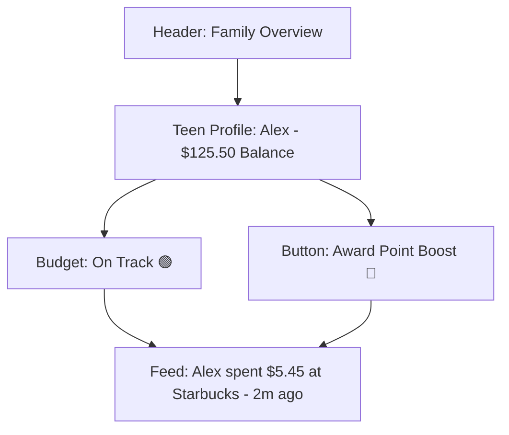

# mystsh Mock Screenshots & Wireframes (Tracker Model)

This document provides visual representations of the core screens for the mystsh Stash Tracker.

---

## 1. Teen Dashboard (Home Screen)
**Goal:** High-energy, Dark Mode view of current "Stash" and spending habits.

```mermaid
graph TD
    A[Header: Hello, Alex 👋 | 💎 1,250 pts]
    B[Budget Meter: [======--] $125/$200 - ELEC BLUE]
    C[Section: Activity Feed]
    D[Activity: Starbucks - $5.45 | Budget Streak! +5 pts]
    E[Activity: Steam - $12.99]
    F[Bottom Nav: Home | Quests | Goals | Rewards]

    A --> B --> C --> D --> E --> F
```

### High-Fidelity ASCII Mock
```text
┌──────────────────────────────────────────────────────────┐
│ 10:41                                  [ 💎 1,250⭐]  │
├──────────────────────────────────────────────────────────┤
│  Hello, Alex 👋                                   [User] │
│                                                          │
│  Weekly Budget Status                                    │
│  [██████████████░░░░] $125.50 / $200      (ELEC BLUE)  │
│                                                          │
│  Latest Rewards                                          │
│  "Budget Master" (+5 pts) for Starbucks purchase         │
│                                                          │
│  Recent Activity                                         │
│  ┌────────────────────────────────────────────────────┐  │
│  │ (S) Starbucks                       -$5.45         │  │
│  │ (🎮) Steam                         -$12.99         │  │
│  │ (🛒) 7-Eleven                       -$2.10         │  │
│  └────────────────────────────────────────────────────┘  │
│                                                          │
│  ┌────────────────────────────────────────────────────┐  │
│  │ [🏠 Home]   [💎 Quests]   [🎯 Goals]   [🎁 Rewards] │  │
│  └────────────────────────────────────────────────────┘  │
└──────────────────────────────────────────────────────────┘
```

---

## 2. Parent Dashboard (Monitoring & Boosting)
**Goal:** Trustworthy, simple view of teen spending and points.



### High-Fidelity ASCII Mock
```text
┌──────────────────────────────────────────────────────────┐
│ Family Overview                                   [Settings]
├──────────────────────────────────────────────────────────┤
│  Alex's Stash                                            │
│  Balance: $125.50 (Synced via Wise)                      │
│                                                          │
│  Budget Health                                           │
│  [  ON TRACK 🟢  ]   Limit: $200.00 / week                │
│                                                          │
│  Alex's Activity Feed                                     │
│  • Spent $5.45 at Starbucks (2m ago)                     │
│  • Earned 5 pts for 'Budget Master'                      │
│                                                          │
│  [ 🚀 Award Manual Point Boost ]        (PURPLE BUTTON)   │
└──────────────────────────────────────────────────────────┘
```

---

## 3. Literacy Quest Screen (Teen App)
**Goal:** Educational, interactive modules with point rewards.

### High-Fidelity ASCII Mock
```text
┌──────────────────────────────────────────────────────────┐
│ Quests & Rewards                                [ 1,250⭐]│
├──────────────────────────────────────────────────────────┤
│  Active Quests                                           │
│                                                          │
│  ┌─ Magic of Compounding ─────────────────────────────┐  │
│  │ How your money grows over time.                     │  │
│  │ [██████████████░░░░] 75%               (NEON GRN)   │  │
│  └────────────────────────────────────────────────────┘  │
│                                                          │
│  Marketplace                                             │
│  ┌──────────────────┐  ┌──────────────────┐              │
│  │ $5 Amazon Card   │  │ +5% Savings Boost│              │
│  │ 2,500 pts        │  │ 1,500 pts        │              │
│  └──────────────────┘  └──────────────────┘              │
└──────────────────────────────────────────────────────────┘
```
